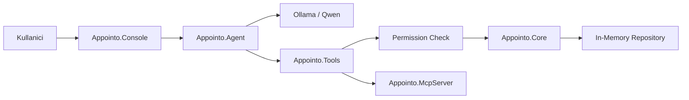

# Appointo AI

Appointo AI, .NET ile gelistirilen, yerel Ollama uzerinde calisan Qwen modelini hedefleyen agentic randevu kayit projesidir.

Bu proje bir randevu botundan daha fazlasidir. Amac, agent mimarisini, structured output uretimini, tool calling yaklasimini, MCP mantigini, eksik bilgi tamamlama akisini, handoff yapisini ve permission kontrollu tool gateway fikrini uygulamali olarak ogrenmektir.

## Ne Yapiyoruz?

Kullanici dogal dilde randevu talebi yazar:

```text
Yarin saat 14:00'e dis doktoru icin randevu al.
```

Agent bu istegi dogrudan veritabanina yazmaz. Once niyeti anlar, eksik bilgileri kontrol eder, uygun tool'u cagirir, backend kurallarindan gelen sonucu kullaniciya acik bir dille doner.

## Neyi Ogreniyoruz?

- Agent bir istegi nasil anlar?
- Structured output neden onemlidir?
- Eksik bilgi nasil tespit edilir?
- Tool calling nasil calisir?
- Business rule neden LLM icinde olmamalidir?
- MCP tool gateway mantigi ne saglar?
- Handoff ile uzman agent'lar nasil ayrilir?
- Conversation state nasil tutulur?
- RAG ile bilgi sorulari islem sorularindan nasil ayrilir?
- Tool permission matrix ile guvenlik nasil saglanir?
- Agent sistemleri nasil test edilir?

## Ornek Kullanim

```text
Kullanici:
Yarin saat 14:00'e dis doktoru icin randevu al.

Agent:
Randevuyu olusturabilmem icin ad soyad ve telefon numaranizi alabilir miyim?

Kullanici:
Ahmet Kaya, 0555 111 22 33

Agent:
30 Haziran 2026 saat 14:00 icin dis doktoru randevunuz uygun gorunuyor. Randevuyu olusturuyorum.

Agent:
Randevunuz olusturuldu. Randevu No: APT-1024
```

## Mimari



## Solution Yapisi

```text
AppointoAI/
  AppointoAI.slnx
  src/
    Appointo.Console/
    Appointo.Agent/
    Appointo.Core/
    Appointo.Tools/
    Appointo.McpServer/
  tests/
    Appointo.Tests/
  docs/
    services.md
    working-hours.md
    cancellation-policy.md
  README.md
```

## Projeler

- `Appointo.Console`: Terminal tabanli chat uygulamasi.
- `Appointo.Agent`: Ollama/Qwen baglantisi, prompt, structured output, agent loop.
- `Appointo.Core`: Appointment domain modeli, business rules, servisler.
- `Appointo.Tools`: Tool sozlesmeleri, tool gateway, permission kontrolu.
- `Appointo.McpServer`: Tool'lari MCP yaklasimina gore disari acacak katman.
- `Appointo.Tests`: Unit, intent, tool, permission ve agent senaryo testleri.

## Temel Randevu Akisi

1. Kullanici istegi alinir.
2. Intent tespit edilir.
3. Structured output olusturulur.
4. Eksik alanlar belirlenir.
5. Eksik bilgi varsa kullaniciya soru sorulur.
6. Bilgiler tamamlaninca availability kontrol edilir.
7. Uygunsa randevu olusturulur.
8. Sonuc kullaniciya dogal dille aciklanir.

## Desteklenen Intent'ler

- `create_appointment`
- `cancel_appointment`
- `reschedule_appointment`
- `list_available_slots`
- `get_appointment_detail`
- `get_service_information`
- `unknown`

## Structured Output

Ilk fazda agent kayit yapmadan kullanici istegini su forma donusturur:

```json
{
  "intent": "create_appointment",
  "customerName": "Ahmet Kaya",
  "phoneNumber": "0555 111 22 33",
  "serviceType": "sac kesim",
  "requestedDate": "2026-06-30",
  "requestedTime": "14:00",
  "missingFields": []
}
```

Bu cikti agent'in ne anladigini gorunur yapar. Hata burada yakalanirsa tool ve backend katmanina yanlis istek gitmez.

## Eksik Bilgi Toplama

Randevu olusturmak icin zorunlu alanlar:

- `customerName`
- `phoneNumber`
- `serviceType`
- `date`
- `time`

Ornek:

```text
Kullanici:
Yarin randevu almak istiyorum.

Agent:
Randevuyu olusturabilmem icin ad soyad ve telefon numaranizi alabilir miyim?
```

Bu fazda agent hemen islem yapan bir bot degil, bilgiyi tamamlayan bir asistandir.

## Appointment Model

Minimum model:

```csharp
public class Appointment
{
    public Guid Id { get; set; }
    public string CustomerName { get; set; }
    public string PhoneNumber { get; set; }
    public string ServiceType { get; set; }
    public DateOnly Date { get; set; }
    public TimeOnly StartTime { get; set; }
    public TimeOnly EndTime { get; set; }
    public string Status { get; set; }
    public string? Notes { get; set; }
}
```

## Business Rules

- Gecmis tarihe randevu olusturulamaz.
- Randevular 09:00 - 18:00 arasinda olmalidir.
- 12:00 - 13:00 arasi ogle molasidir.
- Ayni slota iki aktif randevu verilemez.
- Ayni kisiye ayni gun ayni hizmet icin ikinci randevu verilemez.
- Iptal islemi randevudan en az 2 saat once yapilabilir.
- Hizmet suresi hizmet tipine gore degisir.
- Agent business rule sahibi degildir; kurallar backend servislerinde uygulanir.

## Hizmet Sureleri

- Dis muayenesi: 30 dakika
- Sac kesim: 45 dakika
- Arac bakim: 60 dakika
- Danismanlik: 60 dakika

## Tool Listesi

- `check_availability`
- `create_appointment`
- `cancel_appointment`
- `reschedule_appointment`
- `find_customer_appointments`
- `list_available_slots`
- `find_next_available_slot`
- `get_service_info`

## Tool Calling

Agent tool cagirmadan once intent ve eksik bilgi kontrolu yapar.

```text
Kullanici:
Yarin saat 14:00'e Ahmet Kaya adina dis muayenesi randevusu al.

Agent adimlari:
1. Intent: create_appointment
2. Eksik bilgi var mi? Telefon yok.
3. Kullanicidan telefon ister.
4. check_availability cagirir.
5. Saat uygunsa create_appointment cagirir.
6. Sonucu kullaniciya doner.
```

## Permission Matrix

| Tool | Guest | Verified Customer | Staff | Admin |
| --- | --- | --- | --- | --- |
| `list_available_slots` | Evet | Evet | Evet | Evet |
| `create_appointment` | Evet | Evet | Evet | Evet |
| `cancel_appointment` | Hayir | Kendi randevusu | Evet | Evet |
| `reschedule_appointment` | Hayir | Kendi randevusu | Evet | Evet |
| `list_all_appointments` | Hayir | Hayir | Evet | Evet |
| `delete_customer` | Hayir | Hayir | Hayir | Evet |

Dogru mimari:

```text
User Request
  -> Agent
  -> Tool Gateway
  -> Permission Check
  -> Business Service
  -> Database
```

Agent'a direkt tam yetki verilmez. Yetki kontrolu backend tarafinda yapilir.

## MCP / Tool Gateway

MCP, agent ile dis araclar arasinda standart bir baglanti katmani gibi dusunulebilir.

Bu projede ilk adimda local tool gateway vardir. Sonraki fazda `Appointo.McpServer`, tool'lari MCP server sinirina tasir.

Ornek MCP tool set:

- `appointment.search`
- `appointment.create`
- `appointment.cancel`
- `appointment.reschedule`
- `calendar.getAvailableSlots`
- `customer.find`
- `customer.verifyPhone`
- `notification.sendSms`

## Handoff Agent'lari

Her is tek agent'a yigilmaz. Uzman agent'lar:

- `AppointmentAgent`: Randevu alma, degistirme, iptal etme.
- `CustomerAgent`: Musteri dogrulama, telefon kontrolu, gecmis.
- `AvailabilityAgent`: Takvim uygunlugu ve slot hesaplama.
- `SupportAgent`: Anlasilamayan veya manuel islem gerektiren durumlar.

Ornek:

```text
AppointmentAgent -> CustomerAgent
AppointmentAgent -> AvailabilityAgent
AppointmentAgent -> SupportAgent
```

## State Yonetimi

Kullanici randevu bilgisini tek mesajda vermeyebilir.

```json
{
  "conversationId": "abc-123",
  "intent": "create_appointment",
  "collectedFields": {
    "serviceType": "Arac bakim",
    "date": "2026-07-03",
    "timePreference": "afternoon"
  },
  "missingFields": [
    "customerName",
    "phoneNumber",
    "exactTime"
  ],
  "lastQuestion": "Saat tercihiniz?"
}
```

## RAG Bilgi Tabani

Bilgi sorulari tool islemlerinden ayrilir.

- Randevu islemi: tool
- Hizmet bilgisi: RAG
- Belirsiz istek: clarification

Bilgi dosyalari:

- `docs/services.md`
- `docs/working-hours.md`
- `docs/cancellation-policy.md`

## Test ve Evaluation

Klasik unit test yeterli degildir. Agent projelerinde davranis senaryolari da test edilir.

Intent testleri:

- "Yarin saat 3'e randevu al" -> `create_appointment`
- "Randevumu iptal et" -> `cancel_appointment`
- "Bos saat var mi?" -> `list_available_slots`

Eksik bilgi testleri:

- "Randevu almak istiyorum" -> `serviceType`, `date`, `time`, `customerName`, `phoneNumber` eksik
- "Yarin dis icin randevu al" -> `customerName`, `phoneNumber`, `time` eksik

Business rule testleri:

- Gecmis tarihe randevu alinamaz.
- Calisma saati disinda randevu alinamaz.
- Ogle molasina randevu alinamaz.
- Dolu slota ikinci randevu alinamaz.
- Iptal edilen randevu slotu tekrar uygun olur.

Guvenlik testleri:

- Baskasinin randevularini listeleme engellenir.
- Yetkisi olmayan kullanici admin tool cagiramaz.
- Prompt injection ile permission bypass edilemez.

## Dersle Paralel Ilerleme

### Hafta 1 - Structured Output + Intent

- Appointment intent schema olustur.
- Kullanici mesajindan intent cikar.
- Eksik alanlari tespit et.
- Tarih/saat normalize et.

### Hafta 2 - Tool Calling

- `checkAvailability`
- `createAppointment`
- `cancelAppointment`
- `rescheduleAppointment`

### Hafta 3 - Multi-turn State

- Conversation state tut.
- Eksik bilgileri sirayla tamamlat.
- Kullanicinin onceki cevabini hatirla.

### Hafta 4 - Handoff

- `AppointmentAgent`
- `CustomerAgent`
- `AvailabilityAgent`
- `SupportAgent`

### Hafta 5 - RAG

- Hizmet bilgileri dokumani.
- Calisma saatleri dokumani.
- Iptal politikasi dokumani.

### Hafta 6 - MCP / Tool Gateway

- Tool gateway mantigi.
- Tool permission matrix.
- Tool cagrilarini loglama.

### Hafta 7 - Production Hazirligi

- Logging
- Audit trail
- Error handling
- Retry
- Fallback
- Rate limit
- Prompt/version yonetimi

## MVP Kapsami

Ilk MVP sunlari yapmalidir:

- Kullanici chat uzerinden randevu isteyebilir.
- Agent eksik bilgileri tamamlatir.
- Uygun saatleri kontrol eder.
- Randevu olusturur.
- Randevu iptal eder.
- Randevu yeniden planlar.
- Dolu saatlerde alternatif slot onerir.
- Business rule ihlallerini kullaniciya aciklar.

MVP'ye dahil olmayanlar:

- Gercek SMS entegrasyonu
- Gercek odeme
- Gercek Google Calendar entegrasyonu
- Admin panel
- Karmasik musteri yonetimi

## Calistirma

Console uygulamasi:

```bash
dotnet run --project src/Appointo.Console/Appointo.Console.csproj
```

Structured output test modu:

```text
/parse Yarin saat 14:00 icin Ahmet Kaya adina sac kesim randevusu olustur.
```

Bu komut randevu olusturmaz. Sadece agent'in mesajdan cikardigi intent, alanlar ve eksik bilgileri JSON olarak gosterir.

Local MCP boundary:

```bash
dotnet run --project src/Appointo.McpServer/Appointo.McpServer.csproj
```

Test runner:

```bash
dotnet run --project tests/Appointo.Tests/Appointo.Tests.csproj
```

## Ollama / Qwen

Varsayilan hedef:

```json
{
  "Ollama": {
    "BaseUrl": "http://localhost:11434",
    "Model": "qwen"
  }
}
```

Ilk fazda deterministic parser da vardir. Ollama client sonraki prompt ve structured-output calismalari icin hazir tutulur.

## Commit Plani

1. `chore: initialize appointo ai solution projects`
2. `docs: add detailed appointo ai readme`
3. `feat: add structured appointment intent schema`
4. `feat: add ollama qwen client`
5. `feat: parse appointment requests as structured output`
6. `feat: add appointment domain model and business rules`
7. `feat: add appointment service tools`
8. `feat: implement multi turn conversation state`
9. `feat: add tool gateway permissions`
10. `feat: add local mcp server boundary`
11. `feat: introduce handoff agents`
12. `feat: add rag knowledge base documents`
13. `test: cover appointment agent scenarios`
14. `docs: add course learning notes`

## Sonraki Fazlar

- SQLite + EF Core
- ASP.NET Core Web API
- Minimal web UI
- Google Calendar veya Outlook entegrasyonu
- Coklu personel/takvim destegi
- Hizmet katalog yonetimi
- Musteri kayitlari
- SMS/e-posta mock servisleri
- Conversation memory
- Agent tracing/log ekrani

## Benim Ogrenme Hedefim

Bu projeyi sadece "randevu botu" gibi dusunme.

Asil hedef:

- Agent bir istegi nasil anlar?
- Eksik bilgiyi nasil tamamlar?
- Hangi tool'u ne zaman cagirir?
- Yetkisi olmayan tool'u cagirmasi nasil engellenir?
- Handoff nasil yapilir?
- State nasil tutulur?
- RAG ile islem ayrimi nasil yapilir?
- Production'da nasil izlenir?

Bu proje bittiginde ayni mimariyle Jira issue analysis agent, bayi sorgulama agent, dokuman olusturma agent, satis destek agent, servis talebi agent, IK basvuru agent veya teknik destek agent yazabilecek seviyeye gelmek hedeflenir.
